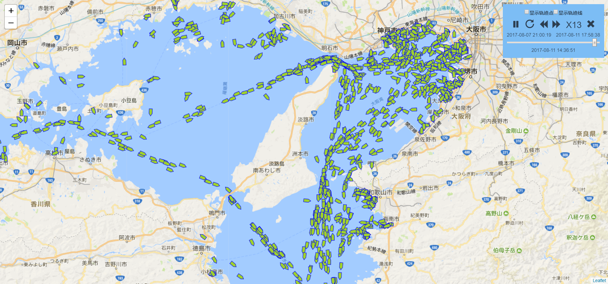
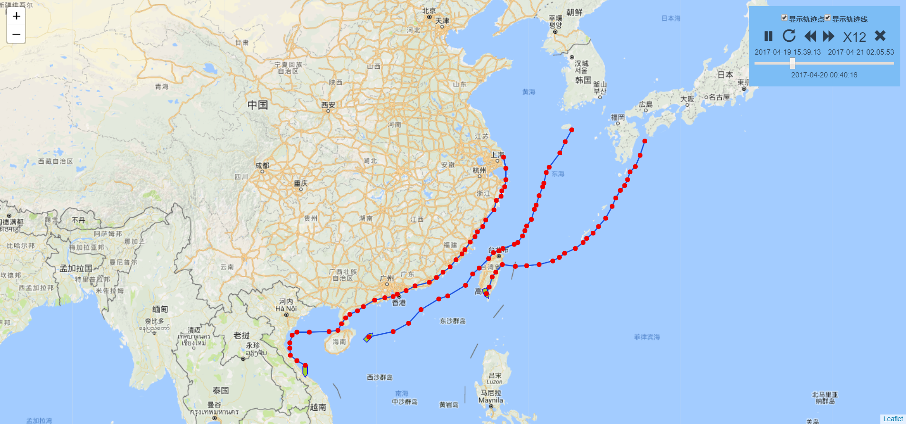

# Leaflet.TrackPlayback

## Introduce

It's a track playback plugin based on leaflet.You need provide some GPS data and time data, then you can play the track on the map.Support track playback, pause, fast forward, fast reverse operation.

## Requirements

- leaflet version: >=0.7
- bootstrap3.7.7 (if you need playbackControl)

## Demo

[Demo](https://linghuam.github.io/Leaflet.TrackPlayback/)






## Usage

``` bash
# install dependencies
npm install

# 生成 dist/LeafletPlayback.js文件
npm run dev

# 生成 dist/LeafletPlayback.min.js文件
npm run build

```
具体使用方法参照[index.html](index.html)页面


## Example

[查看Demo](https://linghuam.github.io/TrackPlayback/)

``` javascript
// 调用代码
var map = L.map('leaflet-map').setView([34, 133], 8)
L.tileLayer.GoogleLayer().addTo(map)
$.getJSON('src/assets/data/3.json', function (Data) {
  L.control.playback({
    data: Data
  }).addTo(map)
})
```

## API reference


假设物体是以直线运动的。
不考虑GPS点位漂移及信号中断问题。

## Custome your Data

you can change the method '_dataTransform' in 'src/control.playback/control.playback.js'

to transform data to standard format like this.

```
// standard format data
[
  {
    timePosList: [{lat:30, lng:116, time:1502529980, dir:320, heading:300, info:[]}, ....]
  },
  {
    timePosList: [{lat:30, lng:116, time:1502529980, dir:320, heading:300, info:[]}, ....]
  },
  {
    timePosList: [{lat:30, lng:116, time:1502529980, dir:320, heading:300, info:[]}, ....]
  }...
]

```

## Problem

如果您有好的建议或意见,[欢迎提问](https://github.com/linghuam/TrackPlayback/issues)


## Recommend

* [HTML5 Canvas核心技术(书籍)](https://book.douban.com/subject/24533314/)
* [html5 canvas教程](http://www.w3cplus.com/blog/tags/616.html?page=1)
* [曲线轨迹动画原理](http://www.tuicool.com/articles/zaeQf22)
* [WebGIS中使用ZRender实现轨迹前端动态播放特效](http://www.cnblogs.com/naaoveGIS/p/6718822.html)


## License

[MIT license](https://opensource.org/licenses/mit-license.php)
