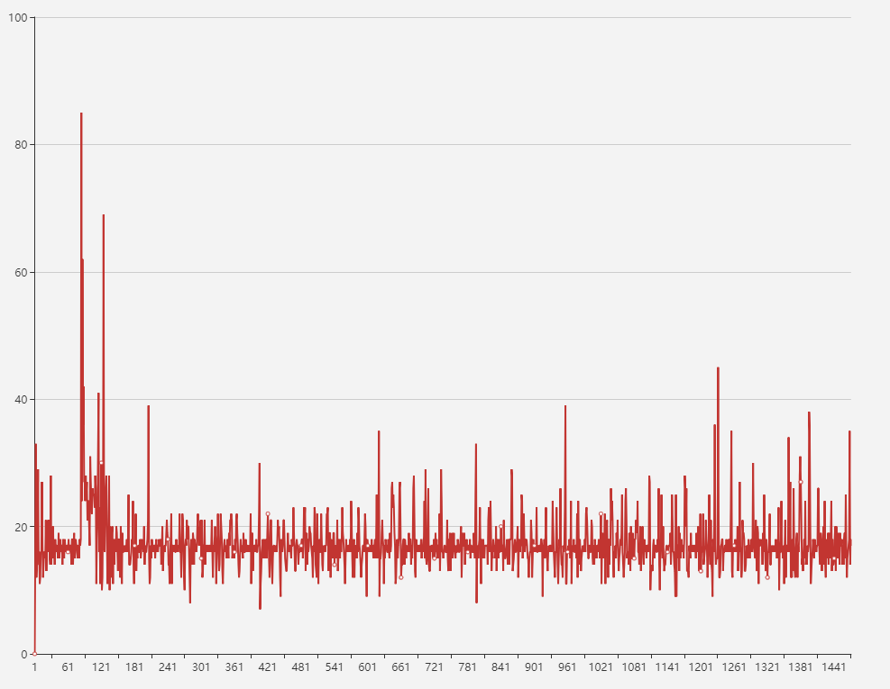

# Leaflet.TrackPlayBack

## Introduce

It's a track playback plugin based on leaflet and HTML5 canvas.

To use it,you need provide some GPS data and time data, then you can play the track on the map.

Support track playback, pause, fast forward, fast reverse operation.

## Requirements

- leaflet version: >1.0.0

## Demo

[Click here to see demo](https://linghuam.github.io/Leaflet.TrackPlayBack/)

## Usage

Using npm:

```shell
npm i leaflet
npm i leaflet-plugin-trackplayback
```

example:

```js
import L from 'leaflet'
import 'leaflet-plugin-trackplayback'

const trackplayback = L.trackplayback(data, map);
// or
const trackplayback = new L.TrackPlayBack(data, map);
```

Using script tag:

```html
  <link rel="stylesheet" href="./lib/leaflet/leaflet.css">

  <!--Optional (only if you need plaback control)-->
  <link rel="stylesheet" href="../dist/control.playback.css">

  <script src="./lib/leaflet/leaflet.js"></script>

  <!--Optional (only if you need plaback control)-->
  <script src="../dist/control.trackplayback.js"></script>

  <script src="../dist/leaflet.trackplayback.js"></script>
```

example:

```js
    const trackplayback = L.trackplayback(data, map);

    // Optional  (only if you need plaback control)
    const trackplaybackControl = L.trackplaybackcontrol(trackplayback);

    trackplaybackControl.addTo(map);
```

## API reference

### initialize(data, map, options)

`data` can be:

when you want to play back one track

```js
[{lat:30, lng:116, time:1502529980, dir:320, info:[{key: 'name', value: 'ship1'}]}, ....]
```

or

when you want to play back more tracks

```js
[[{lat:30, lng:116, time:1502529980, dir:320, info:[]}, ....], [{lat:30, lng:116, time:1502529980, dir:320, info:[]}, ....]]
```

the trackpoint obj properties:

- lat: Latitude of target
- lng: Longitude of target
- time: unix timestamp
- dir(Optional): Moving direction(0-360 degrees, Clockwise direction), if you don't provide it, the program can auto caculate the target direction
- info(Optional): other static information of the target, it's an array of key-value pairs

`map` is the L.map instance.

`options` can be:

```js
const Options = {
  // the play options
  clockOptions: {
    // the default speed
    // caculate method: fpstime * Math.pow(2, speed - 1)
    // fpstime is the two frame time difference
    speed: 13,
    // the max speed
    maxSpeed: 65
  },
  // trackPoint options
  trackPointOptions: {
    // whether draw track point
    isDraw: false,
    // whether use canvas to draw it, if false, use leaflet api `L.circleMarker`
    useCanvas: true,
    stroke: false,
    color: '#ef0300',
    fill: true,
    fillColor: '#ef0300',
    opacity: 0.3,
    radius: 4
  },
  // trackLine options
  trackLineOptions: {
    // whether draw track line
    isDraw: false,
    stroke: true,
    color: '#1C54E2',
    weight: 2,
    fill: false,
    fillColor: '#000',
    opacity: 0.3
  },
  // target options
  targetOptions: {
    // whether use image to display target, if false, the program provide a default
    useImg: false,
    // if useImg is true, provide the imgUrl
    imgUrl: '../../static/images/ship.png',
    // the width of target, unit: px
    width: 8,
    // the height of target, unit: px
    height: 18,
    // the stroke color of target, effective when useImg set false
    color: '#00f',
    // the fill color of target, effective when useImg set false
    fillColor: '#9FD12D'
  }
}

```

### events

```js
// trigger on time change
trackplayback.on('tick', e => {
  console.log(e.time)
}, this)
```

### methods

#### # start()

start play, return this

#### # stop()

stop play, return this

#### # rePlaying()

replay, return this

#### # slowSpeed()

slow play speed, return this

#### # quickSpeed()

quick play speed, return this

#### # getSpeed()

get play speed, return speed value

#### # getCurTime()

get current time, return unix timestamp

#### # getStartTime()

get start time, return unix timestamp

#### # getEndTime()

get end time, return unix timestamp

#### # isPlaying()

whether in playing, return true or false

#### # setCursor(time)

set current playing time, need a unix timestamp param, return this

#### # setSpeed(speed)

set the playback speed, return this

#### # showTrackPoint()

draw track point, return this

#### # hideTrackPoint()

remove track point, return this

#### # showTrackLine()

draw track line, return this

#### # hideTrackLine()

remove track line, return this

#### # dispose()

destory the trackplayback instance, when call this, the trackplayback instance can't be used again and the program will clear track layer.

## performance

I collected the frame rate for a while.



## Issues

If you have good suggestions or comments,[welcome to ask questions](https://github.com/linghuam/TrackPlayback/issues).

## Recommends

1. [html5 canvas](https://developer.mozilla.org/en-US/docs/Web/API/Canvas_API/Tutorial)
2. [LeafletPlayback](https://github.com/hallahan/LeafletPlayback)

## License

[MIT license](https://opensource.org/licenses/mit-license.php)
